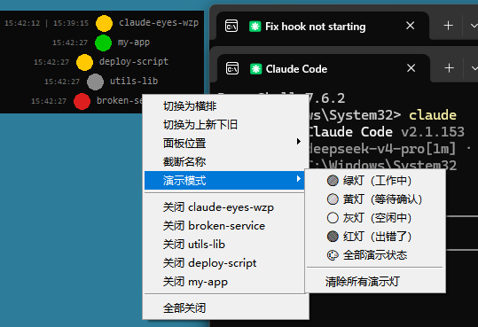

# Claude Eyes

A floating status indicator panel for [Claude Code](https://claude.ai) sessions. Shows what each Claude window is doing — at a glance, always on top.



## Why

Claude Code's CLI interface doesn't surface session status visually. When you have multiple windows open, you can't tell which one is working, waiting for input, or sitting idle without alt-tabbing into each one. Claude Eyes puts a small colored dot for each session on your screen — always visible, zero clicks.

## Install

```bash
pip install git+https://github.com/wzp0514/claude-eyes.git
python -m claude_eyes.setup
```

Restart Claude Code. The panel appears in the bottom-right corner.

Requires **Python 3.9+** with tkinter (bundled with standard Python on Windows and macOS; on Linux, `sudo apt install python3-tk`).

## Status indicators

| Color | Meaning |
|-------|---------|
| Green | Working — Claude is processing |
| Yellow (blink) | Waiting — Claude needs your input or approval |
| Gray | Idle — session is open but nothing in progress |
| Red (blink) | Error — a tool call or operation failed |

Lights appear and disappear automatically as you open and close Claude Code windows.

## Features

- **Always on top** — draggable borderless panel, never buried under other windows
- **Multi-session** — one dot per Claude Code window, auto add/remove
- **Right-click menu** — toggle layout (vertical/horizontal), sort order, position, demo mode
- **Dual timestamps** — shows when you sent a prompt and when Claude finished
- **Auto-recovery** — starts with Claude Code, restarts if it crashes
- **Zero dependencies** — Python stdlib + tkinter only, no pip packages required

## Documentation

- [Full English docs](README_en.md) — detailed setup, architecture, performance
- [完整中文文档](README_zh.md) — 安装指南、架构说明、性能数据

## License

MIT — see [LICENSE](LICENSE).
